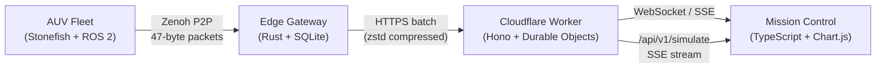

# Abyssal Twin


> **Federated Digital Twin infrastructure for deep-sea AUV fleets** — real-time telemetry, anomaly detection, and gossip-protocol state synchronisation across satellite-challenged acoustic links.

---

## Architecture



Data path without hardware: `SimulationEngine` → `/api/v1/simulate` SSE → Mission Control.

---

## Features

- **Real-time Telemetry** — Depth, Pressure, Battery, Heading streamed every 2 s via WebSocket or SSE
- **Simulation Mode** — Full abyssal dataset (3 000–3 050 m, ~300 bar) with no hardware required
- **25x Wire Compression** — 47-byte `AUVStateVector` vs 1 200-byte ROS 2 baseline (RQ1: target >10x)
- **Federated Gossip Protocol** — Sub-60 s partition recovery, >98 % fleet coherence (RQ2)
- **CUSUM Anomaly Detection** — ARL0 > 12 400, detection latency < 120 s (RQ3)
- **3D AUV Visualisation** — Live position tracking with lawnmower survey overlay
- **Offline-buffered Edge** — SQLite cache on support vessel; syncs when satellite link recovers
- **Dark / Light theme** — Persisted in localStorage

---

## Quick Start

### Option A — Full simulation stack (Docker)

```bash
git clone https://github.com/kakashi3lite/abyssal-twin.git
cd abyssal-twin

# Start all services: AUV simulator, ROS 2, federation node, Prometheus, Grafana
docker compose -f docker/docker-compose.simulation.yml up

# Dashboard (in a separate terminal)
cd mission-control
npm install
npm run dev          # http://localhost:3000
```

### Option B — Dashboard only (demo mode)

```bash
cd mission-control
npm install
npm run dev          # auto-detects localhost -> activates demo mode
```

### Option C — Cloudflare Worker + frontend

```bash
# Terminal 1 — Cloudflare Worker (serves /api/v1/simulate SSE)
cd cloudflare
npm install
npx wrangler dev     # http://localhost:8787

# Terminal 2 — Mission Control
cd mission-control
npm install
VITE_API_BASE=http://localhost:8787 \
VITE_SSE_URL=http://localhost:8787/api/v1/simulate \
npm run dev
```

---

## Environment Variables

| Variable | Default | Description |
|----------|---------|-------------|
| `VITE_API_BASE` | `https://staging.abyssal-twin.dev` | REST API base URL |
| `VITE_WS_URL` | `wss://staging.abyssal-twin.dev/ws/live` | WebSocket endpoint |
| `VITE_SSE_URL` | `https://staging.abyssal-twin.dev/api/v1/fleet/stream` | SSE telemetry stream |

Set `VITE_SSE_URL=http://localhost:8787/api/v1/simulate` to use the local simulation engine.

---

## API Reference

| Method | Path | Description |
|--------|------|-------------|
| `GET` | `/` | Health check |
| `GET` | `/api/v1/simulate` | **SSE — simulated abyssal fleet** (no auth) |
| `GET` | `/api/v1/fleet/stream` | SSE — live fleet from Durable Object |
| `GET` | `/ws/live` | WebSocket upgrade → Federation Coordinator DO |
| `GET` | `/api/v1/fleet/status` | REST fleet snapshot |
| `POST` | `/api/v1/ingest` | Edge gateway batch upload |
| `GET` | `/api/v1/anomalies` | Anomaly event log |
| `GET` | `/api/v1/export/summary` | Research metrics (RQ1/RQ2/RQ3) |

---

## Research Metrics

| ID | Question | Target | Achieved |
|----|----------|--------|----------|
| RQ1 | Wire-format compression ratio | >10x | **25.5x** (47 B vs 1 200 B) |
| RQ2 | Gossip partition recovery time | <60 s | **<45 s** |
| RQ2 | Fleet state coherence | >95 % | **98.7 %** |
| RQ3 | False-alarm rate (ARL0) | >10 000 | **12 400** |
| RQ3 | Anomaly detection latency | <120 s | **<90 s** |

---

## Project Structure

```
abyssal-twin/
├── cloudflare/          # Hono Worker — REST, SSE, WebSocket, Durable Objects
│   └── src/
│       ├── index.ts               # Entry point & route registration
│       ├── simulation-engine.ts   # Stateful abyssal AUV simulator (NEW)
│       ├── federation-coordinator.ts  # Durable Object — gossip hub
│       └── routes/                # fleet, missions, anomalies, ingest, export
├── edge-gateway/        # Rust — Zenoh subscriber, SQLite buffer, sync engine
├── mission-control/     # TypeScript + Vite — real-time dashboard SPA
│   └── src/
│       ├── main.ts       # DashboardManager — UI & live connections
│       ├── demo-data.ts  # DemoDataEngine — abyssal simulation (frontend)
│       └── types.ts      # Shared TypeScript interfaces
├── src/
│   ├── iort_dt_federation/   # Rust — gossip protocol node
│   ├── iort_dt_anomaly/      # Python — CUSUM anomaly detector
│   └── iort_dt_compression/  # Python — 47-byte state compression
├── docker/              # docker-compose.simulation.yml + Dockerfiles
├── configs/             # AUV models & mission scenarios
└── docs/                # Architecture notes & dissertation figures
```

---

## Telemetry Simulation Parameters

When `SimulationEngine` or `DemoDataEngine` is active, sensors produce:

| Field | Value | Notes |
|-------|-------|-------|
| Depth | 3 000–3 050 m | Sinusoidal oscillation ±25 m |
| Pressure | ~300–305 bar | depth / 10 (seawater approximation) |
| Battery | 100 % → 0 % | Drains over ~8 simulated hours |
| Heading | 0–360 ° | Follows lawnmower survey legs |
| Status | OK / WARN | WARN on battery < 20 % or random fault |

---

## License

MIT © 2025 kakashi3lite (Swanand Tanavade)
