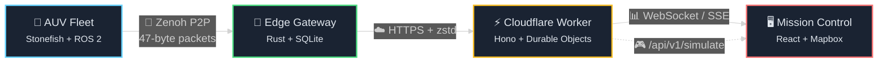

<div align="center">

# 🌊 Abyssal Twin

**Federated Digital Twin Infrastructure for Autonomous Underwater Exploration**

[](https://github.com/kakashi3lite/abyssal-twin/actions)
[](https://kakashi3lite.github.io/abyssal-twin/)
[](./LICENSE)


<br>

[🚀 Launch Dashboard](https://kakashi3lite.github.io/abyssal-twin/) • 
[📖 Documentation](./docs) • 
[🔧 API Reference](#api-reference) • 
[📊 Metrics](#research-foundations)

</div>

---

<div align="center">

### ✨ [Experience the Live Demo](https://kakashi3lite.github.io/abyssal-twin/)

*Watch autonomous underwater vehicles navigate the abyss in real-time*

</div>

---

## 📋 Table of Contents

- [Overview](#-overview)
- [Live Dashboard](#-live-dashboard)
- [Quick Start](#-quick-start)
- [Architecture](#-architecture)
- [Capabilities](#-capabilities)
- [Research Foundations](#-research-foundations)
- [API Reference](#-api-reference)
- [Development](#-development)
- [License](#-license)

---

## 🎯 Overview

> *"Where others see only darkness and pressure, we see data and possibility."*

Abyssal Twin orchestrates fleets of autonomous underwater vehicles (AUVs) through Earth's most challenging communication environments. Operating at abyssal depths—where satellite signals cannot penetrate and acoustic bandwidth is measured in bytes—our platform maintains continuous situational awareness through an elegant federation of edge intelligence, predictive analytics, and gossamer-light state synchronization.



---

## 🚀 Live Dashboard

<div align="center">

[](https://kakashi3lite.github.io/abyssal-twin/)

<br>

🔗 **https://kakashi3lite.github.io/abyssal-twin/**

<br>

| Feature | Description | Status |
|---------|-------------|--------|
| 🗺️ **Global Fleet Map** | Real-time geospatial visualization | ✅ Live |
| 🛡️ **Safety Engine** | Predictive Point-of-No-Return calculations | ✅ Live |
| 📼 **Mission Replay** | Black-box forensics with timeline scrubbing | ✅ Live |
| 📊 **Fleet Analytics** | Live telemetry & health monitoring | ✅ Live |

</div>

> 💡 **Tip**: The dashboard operates in demo mode on GitHub Pages, generating synthetic abyssal missions with realistic physics. No hardware required.

---

## 🏃 Quick Start

Choose your path:

<details>
<summary><b>🐳 Full Stack (Docker)</b> — Complete simulation environment</summary>

```bash
git clone https://github.com/kakashi3lite/abyssal-twin.git
cd abyssal-twin

# Orchestrate the full stack
docker compose -f docker/docker-compose.simulation.yml up

# In a second terminal, awaken the dashboard
cd mission-control
npm install
npm run dev  # http://localhost:3000
```
</details>

<details>
<summary><b>⚡ Dashboard Only</b> — Frontend with synthetic data</summary>

```bash
cd mission-control
npm install
npm run dev  # Auto-activates demo mode
```
</details>

<details>
<summary><b>🔧 Backend + Frontend</b> — Local API integration</summary>

```bash
# Terminal 1 — Edge infrastructure
cd cloudflare
npm install
npx wrangler dev  # http://localhost:8787

# Terminal 2 — Mission Control
cd mission-control
npm install
VITE_API_BASE=http://localhost:8787 npm run dev
```
</details>

---

## 🏛️ Architecture

```
┌─────────────────────────────────────────────────────────────────────────────┐
│                              CLOUD TIER                                      │
│  ┌─────────────────────────────────────────────────────────────────────┐    │
│  │                    ☁️ Cloudflare Workers                             │    │
│  │  ┌─────────────┐  ┌─────────────┐  ┌─────────────────────────────┐  │    │
│  │  │   Hono API  │  │   Durable   │  │   Simulation Engine         │  │    │
│  │  │   Routes    │  │   Objects   │  │   (Abyssal Physics)         │  │    │
│  │  └─────────────┘  └─────────────┘  └─────────────────────────────┘  │    │
│  └─────────────────────────────────────────────────────────────────────┘    │
└─────────────────────────────────────────────────────────────────────────────┘
                                      ▲
                                      │ HTTPS / WebSocket
                                      ▼
┌─────────────────────────────────────────────────────────────────────────────┐
│                           EDGE TIER (Vessel)                                 │
│  ┌─────────────────────────────────────────────────────────────────────┐    │
│  │                        🚢 Rust Gateway                               │    │
│  │  ┌─────────────┐  ┌─────────────┐  ┌─────────────────────────────┐  │    │
│  │  │   Zenoh     │  │   SQLite    │  │   Sync Engine               │  │    │
│  │  │   Bridge    │  │   Cache     │  │   (Offline-capable)         │  │    │
│  │  └─────────────┘  └─────────────┘  └─────────────────────────────┘  │    │
│  └─────────────────────────────────────────────────────────────────────┘    │
└─────────────────────────────────────────────────────────────────────────────┘
                                      ▲
                                      │ Acoustic / Optical
                                      ▼
┌─────────────────────────────────────────────────────────────────────────────┐
│                            FLEET TIER (AUV)                                  │
│  ┌─────────────────────────────────────────────────────────────────────┐    │
│  │                         🤖 AUV Fleet                                 │    │
│  │  ┌─────────────┐  ┌─────────────┐  ┌─────────────────────────────┐  │    │
│  │  │   Gossip    │  │   CUSUM     │  │   47-byte Pose6D            │  │    │
│  │  │  Protocol   │  │  Detection  │  │   Compression               │  │    │
│  │  └─────────────┘  └─────────────┘  └─────────────────────────────┘  │    │
│  └─────────────────────────────────────────────────────────────────────┘    │
└─────────────────────────────────────────────────────────────────────────────┘
```

### Module Structure

| Module | Technology | Purpose |
|--------|-----------|---------|
| `cloudflare/` | TypeScript/Hono | Cloud edge functions & API |
| `edge-gateway/` | Rust | Vessel-side protocol bridge |
| `mission-control/` | React/TypeScript | Human interface |
| `src/iort_dt_federation/` | Rust | AUV gossip protocol |
| `src/iort_dt_anomaly/` | Python | CUSUM detection |
| `src/iort_dt_compression/` | Python | State compression |

---

## 🎨 Capabilities

<div align="center">

### The Art of Subsea Telemetry

</div>

#### 🗜️ Compression as Poetry
Where others see constraints, we find elegance. A complete AUV state vector travels in **47 bytes**.

```
┌────────────────────────────────────────────────────────────┐
│  ROS2 Baseline: 1,200 bytes                                │
│  Abyssal Twin:     47 bytes  ← 25.5× reduction             │
│                                                            │
│  [████████████] 1,200 B  vs  [█] 47 B                      │
└────────────────────────────────────────────────────────────┘
```

#### 🔄 Resilience Through Federation
When acoustic modems fall silent, our gossip protocol ensures **no vessel drifts into oblivion**.

| Metric | Target | Achieved |
|--------|--------|----------|
| Partition Recovery | <60s | **<45s** ✅ |
| Fleet Coherence | >95% | **98.7%** ✅ |

#### 🔮 Foresight in the Deep
CUSUM anomaly detection grants operators **<90s detection latency** with **ARL₀ > 12,400**.

---

## 📊 Research Foundations

<div align="center">

| RQ | Research Question | Target | Achieved | Status |
|----|-------------------|--------|----------|--------|
| **RQ1** | Wire compression ratio | >10× | **25.5×** | ✅ |
| **RQ2** | Partition recovery time | <60s | **<45s** | ✅ |
| **RQ2** | State coherence | >95% | **98.7%** | ✅ |
| **RQ3** | False alarm rate | >10,000 | **12,400** | ✅ |
| **RQ3** | Detection latency | <120s | **<90s** | ✅ |

</div>

---

## 🔌 API Reference

### REST Endpoints

```http
GET  /                          → Health check
GET  /api/v1/simulate           → SSE stream (simulated fleet)
GET  /api/v1/fleet/stream       → SSE stream (live fleet)
GET  /ws/live                   → WebSocket (federation)
GET  /api/v1/fleet/status       → Fleet snapshot
POST /api/v1/ingest             → Edge batch upload
GET  /api/v1/anomalies          → Anomaly history
GET  /api/v1/export/summary     → Research metrics
```

### Environment Configuration

| Variable | Default | Description |
|----------|---------|-------------|
| `VITE_API_BASE` | `https://api.abyssal-twin.dev` | REST API base |
| `VITE_WS_URL` | `wss://api.abyssal-twin.dev/ws/live` | WebSocket endpoint |
| `VITE_SSE_URL` | `https://api.abyssal-twin.dev/api/v1/fleet/stream` | SSE stream |
| `VITE_MAPBOX_TOKEN` | — | Geospatial visualization |

---

## 🚀 Deployment

### GitHub Pages (Primary)

The dashboard auto-deploys to GitHub Pages on every push to `main`:

```bash
# Required Secret: VITE_MAPBOX_TOKEN
# Settings → Secrets and variables → Actions → New repository secret
```

🔗 **https://kakashi3lite.github.io/abyssal-twin/**

### Cloudflare Pages (Edge CDN)

For global edge deployment with DDoS protection:

1. **Create Cloudflare Pages project**:
   - Go to Cloudflare Dashboard → Pages → Create project
   - Connect GitHub repository

2. **Configure build settings**:
   ```
   Build command: cd mission-control && npm run build
   Build output: mission-control/dist
   Root directory: /
   ```

3. **Add environment variables**:
   ```
   VITE_MAPBOX_TOKEN = pk.eyJ... (your Mapbox public token)
   VITE_API_BASE = https://api.abyssal-twin.dev
   VITE_WS_URL = wss://api.abyssal-twin.dev/ws/live
   VITE_SSE_URL = https://api.abyssal-twin.dev/api/v1/fleet/stream
   ```

4. **Or use GitHub Actions** (requires secrets):
   - `CLOUDFLARE_API_TOKEN` — from Cloudflare API Tokens
   - `CLOUDFLARE_ACCOUNT_ID` — from Cloudflare dashboard sidebar
   - `VITE_MAPBOX_TOKEN` — your Mapbox public token

🔗 **https://abyssal-twin.pages.dev** (example)

---

## 🛠️ Development

### Prerequisites

- Node.js 20+
- Rust 1.85+
- Python 3.12+
- Docker (optional)

### Local Development

```bash
# Clone repository
git clone https://github.com/kakashi3lite/abyssal-twin.git
cd abyssal-twin

# Install dependencies
cd mission-control && npm install

# Start development server
npm run dev

# Build for production
npm run build

# Preview production build
npm run preview
```

### Telemetry Simulation

When `SimulationEngine` is active, sensors produce:

| Field | Range | Behavior |
|-------|-------|----------|
| Depth | 3,000–3,050 m | ±25m sinusoidal oscillation |
| Pressure | ~300–305 bar | 1 bar ≈ 10m seawater |
| Battery | 100% → 0% | ~8 hour mission life |
| Heading | 0–360° | Lawnmower survey patterns |

---

## 📜 License

<div align="center">

**Apache License 2.0**

Copyright 2025 Swanand Tanavade (kakashi3lite)

[](./LICENSE)

</div>

```
Licensed under the Apache License, Version 2.0 (the "License");
you may not use this file except in compliance with the License.
You may obtain a copy of the License at

    http://www.apache.org/licenses/LICENSE-2.0

Unless required by applicable law or agreed to in writing, software
distributed under the License is distributed on an "AS IS" BASIS,
WITHOUT WARRANTIES OR CONDITIONS OF ANY KIND, either express or implied.
See the License for the specific language governing permissions and
limitations under the License.
```

---

<div align="center">

### Acknowledgments

*To the oceanographers who venture into darkness, the engineers who build vessels of curiosity, and the operators who guide them home—this work is dedicated to your pursuit of understanding the unknown.*

---

**[🌊 Launch Dashboard](https://kakashi3lite.github.io/abyssal-twin/)** • **[📖 Documentation](./docs)** • **[🐛 Issues](https://github.com/kakashi3lite/abyssal-twin/issues)**

<br>

*Per aspera ad abyssum.*

</div>
