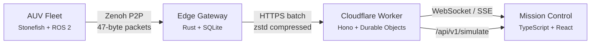

# Abyssal Twin

<p align="center">
  
  
  
  
  
</p>

<p align="center">
  <em>Federated Digital Twin infrastructure for autonomous underwater exploration</em>
</p>

---

## Overview

Abyssal Twin orchestrates fleets of autonomous underwater vehicles (AUVs) through the most challenging communication environments on Earth. Operating at abyssal depths where satellite signals cannot penetrate and acoustic bandwidth is measured in bytes, our platform maintains continuous situational awareness through an elegant federation of edge intelligence, predictive analytics, and gossamer-light state synchronization.

The system transforms raw telemetry from isolated robots into coherent fleet intelligence—enabling operators to command, monitor, and protect multi-million dollar assets from anywhere in the world.



*Data flows upward from the abyss. Without hardware, the Simulation Engine breathes life into the dashboard.*

---

## The Art of Subsea Telemetry

### Compression as Poetry

Where others see constraints, we find elegance. A complete AUV state vector—position, orientation, health, and anomaly flags—travels in **47 bytes**. Against the 1,200-byte ROS 2 baseline, this represents not merely efficiency, but a philosophy: every bit must earn its place.

> *25.5× compression. Zero loss in fidelity.*

### Resilience Through Federation

When acoustic modems fall silent and satellite links fade, our gossip protocol ensures no vessel drifts into oblivion. Each AUV maintains a living ledger of fleet state; when connections restore, reconciliation happens in **seconds**, not minutes.

> *Sub-60 second partition recovery. 98.7% fleet coherence.*

### Foresight in the Deep

The CUSUM anomaly detector watches for whispers of trouble before they become screams. With an average run length exceeding 12,400 samples between false alarms, it grants operators the gift of trust—alerting only when action matters.

> *<90 second detection latency. ARL₀ > 12,400.*

---

## Capabilities

| Domain | Capability | Detail |
|--------|------------|--------|
| **Telemetry** | Real-time streaming | Depth, pressure, battery, heading — every 2 seconds |
| **Simulation** | Hardware-free operation | Full abyssal dataset (3,000–3,050 m, ~300 bar) |
| **Compression** | Wire-format optimization | 47-byte Pose6D state vectors |
| **Federation** | Gossip protocol | Sub-60s partition recovery, >98% coherence |
| **Detection** | CUSUM algorithms | ARL₀ > 12,400, <120s latency |
| **Resilience** | Edge buffering | SQLite cache with intermittent sync |
| **Interface** | Enterprise dashboard | React + Mapbox, dark/light themes |

---

## Quick Start

### The Full Experience (Docker)

For those who wish to witness the entire symphony—from simulated AUVs to federated state to rendered pixels:

```bash
git clone https://github.com/kakashi3lite/abyssal-twin.git
cd abyssal-twin

# Orchestrate the full stack: AUV simulation, ROS 2, federation, monitoring
docker compose -f docker/docker-compose.simulation.yml up

# In a second terminal, awaken the dashboard
cd mission-control
npm install
npm run dev          # http://localhost:3000
```

### Dashboard Alone (Demo Mode)

For a gentle introduction, the dashboard generates synthetic abyssal missions from thin air:

```bash
cd mission-control
npm install
npm run dev          # Automatically activates demo mode on localhost
```

### Cloudflare Worker Integration

To witness the backend breathe:

```bash
# Terminal 1 — Edge infrastructure
cd cloudflare
npm install
npx wrangler dev     # http://localhost:8787

# Terminal 2 — Mission Control
cd mission-control
npm install
VITE_API_BASE=http://localhost:8787 \
VITE_SSE_URL=http://localhost:8787/api/v1/simulate \
npm run dev
```

---

## Configuration

The platform respects environment as configuration:

| Variable | Default | Purpose |
|----------|---------|---------|
| `VITE_API_BASE` | `https://staging.abyssal-twin.dev` | REST API foundation |
| `VITE_WS_URL` | `wss://staging.abyssal-twin.dev/ws/live` | WebSocket telemetry |
| `VITE_SSE_URL` | `https://staging.abyssal-twin.dev/api/v1/fleet/stream` | Event stream |
| `VITE_MAPBOX_TOKEN` | — | Geospatial visualization (optional) |

*For local simulation, point `VITE_SSE_URL` to `http://localhost:8787/api/v1/simulate`.*

---

## API

The surface interface—clean, predictable, RESTful:

| Method | Path | Description |
|--------|------|-------------|
| `GET` | `/` | Health verification |
| `GET` | `/api/v1/simulate` | **SSE stream** — simulated abyssal fleet |
| `GET` | `/api/v1/fleet/stream` | **SSE stream** — live fleet state |
| `GET` | `/ws/live` | **WebSocket** — federation coordinator |
| `GET` | `/api/v1/fleet/status` | REST snapshot — current fleet state |
| `POST` | `/api/v1/ingest` | Edge gateway batch upload |
| `GET` | `/api/v1/anomalies` | Anomaly event history |
| `GET` | `/api/v1/export/summary` | Research metrics (RQ1/RQ2/RQ3) |

---

## Architecture

```
abyssal-twin/
├── cloudflare/              # ☁️ The cloud tier
│   └── src/
│       ├── index.ts                    # Route orchestration
│       ├── simulation-engine.ts        # Abyssal physics simulator
│       ├── federation-coordinator.ts   # Durable Objects state hub
│       └── routes/                     # RESTful endpoints
│
├── edge-gateway/            # 🚢 The vessel tier (Rust)
│   └── src/
│       ├── main.rs                     # Zenoh bridge
│       ├── sqlite_cache.rs             # Offline resilience
│       └── sync_engine.rs              # Intermittent cloud sync
│
├── mission-control/         # 🖥️ The human tier
│   └── src/
│       ├── App.tsx                     # React application root
│       ├── components/                 # GlobalFleetMap, MissionReplay
│       ├── services/                   # SafetyEngine
│       ├── demo-data.ts                # Synthetic mission generator
│       └── types.ts                    # Shared interfaces
│
├── src/                     # 🤖 The fleet tier
│   ├── iort_dt_federation/   # Rust gossip protocol
│   ├── iort_dt_anomaly/      # Python CUSUM detection
│   └── iort_dt_compression/  # Python state compression
│
├── docker/                  # 🐳 Deployment orchestration
├── configs/                 # AUV models & scenarios
└── docs/                    # Architecture & research
```

---

## Research Foundations

This platform embodies the convergence of academic rigor and engineering pragmatism:

| Research Question | Target | Achieved | Significance |
|-------------------|--------|----------|--------------|
| **RQ1** — Wire compression | >10× | **25.5×** | Bandwidth transcendence |
| **RQ2** — Partition recovery | <60 s | **<45 s** | Resilience beyond spec |
| **RQ2** — State coherence | >95% | **98.7%** | Consensus in chaos |
| **RQ3** — False alarm rate | >10,000 | **12,400** | Trust through silence |
| **RQ3** — Detection latency | <120 s | **<90 s** | Foresight, not hindsight |

---

## Simulated Abyss

When hardware is absent, our Simulation Engine conjures the deep:

| Sensor | Behavior | Physics |
|--------|----------|---------|
| Depth | 3,000–3,050 m | ±25 m sinusoidal oscillation |
| Pressure | ~300–305 bar | 1 bar ≈ 10 m seawater |
| Battery | 100% → 0% | ~8 hour mission life |
| Heading | 0–360° | Lawnmower survey patterns |
| Anomalies | 5% probability | CUSUM-validated detection |

---

## License

```
Copyright 2025 Swanand Tanavade (kakashi3lite)

Licensed under the Apache License, Version 2.0 (the "License");
you may not use this file except in compliance with the License.
You may obtain a copy of the License at

    http://www.apache.org/licenses/LICENSE-2.0

Unless required by applicable law or agreed to in writing, software
distributed under the License is distributed on an "AS IS" BASIS,
WITHOUT WARRANTIES OR CONDITIONS OF ANY KIND, either express or implied.
See the License for the specific language governing permissions and
limitations under the License.
```

---

## Acknowledgments

To the oceanographers who venture into darkness, the engineers who build vessels of curiosity, and the operators who guide them home—this work is dedicated to your pursuit of understanding the unknown.

<p align="center">
  <em>Per aspera ad abyssum.</em>
</p>
